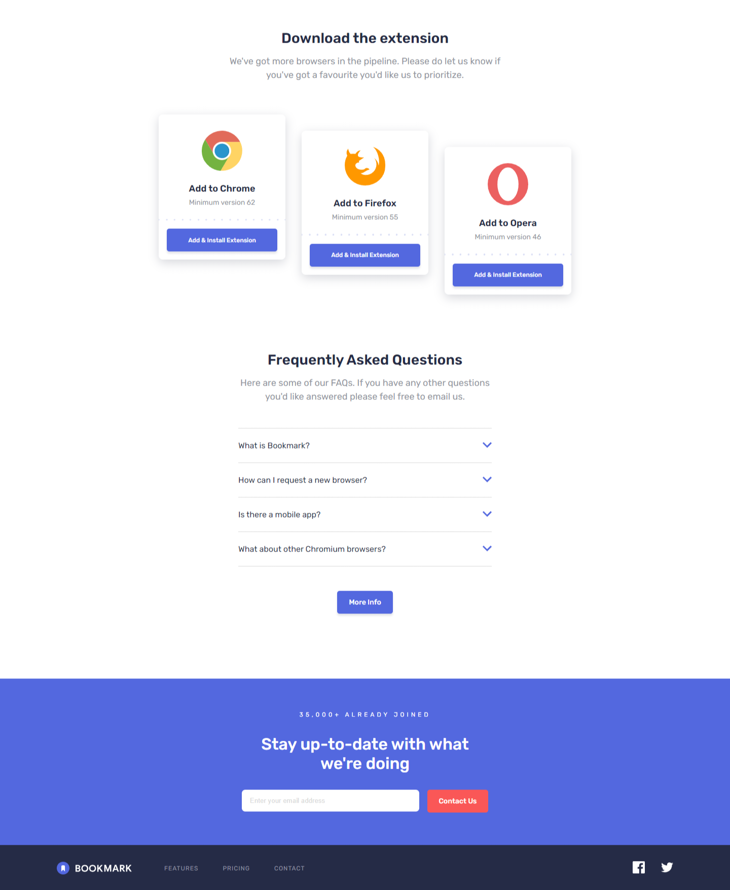
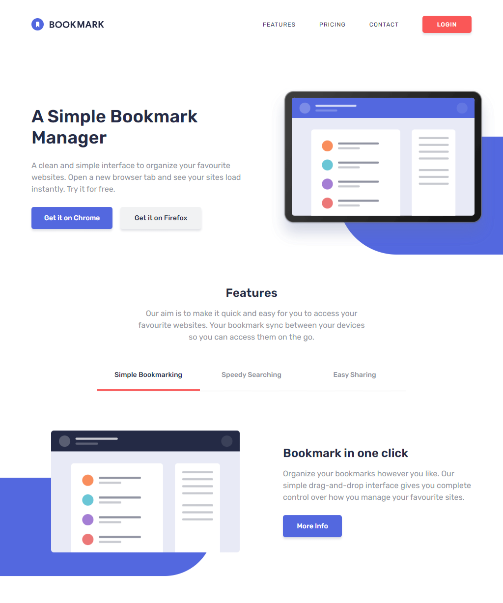
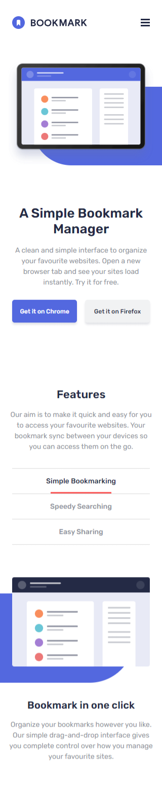
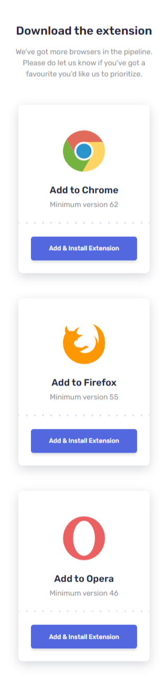
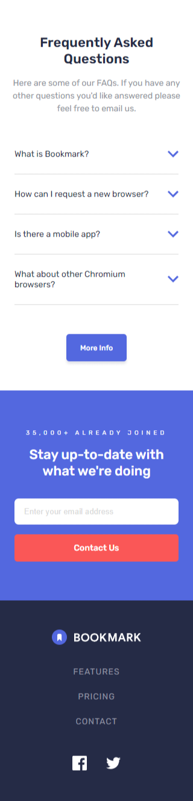

# Frontend Mentor - Bookmark landing page solution

This is a solution to the [Bookmark landing page challenge on Frontend Mentor](https://www.frontendmentor.io/challenges/bookmark-landing-page-5d0b588a9edda32581d29158). Frontend Mentor challenges help you improve your coding skills by building realistic projects.

## Table of contents

- [Overview](#overview)
  - [The challenge](#the-challenge)
  - [Screenshot](#screenshot)
  - [Links](#links)
- [My process](#my-process)
  - [Built with](#built-with)
  - [What I learned](#what-i-learned)
  - [Useful resources](#useful-resources)
- [Author](#author)

## Overview

### The challenge

Users should be able to:

- View the optimal layout for the site depending on their device's screen size
- See hover states for all interactive elements on the page
- Receive an error message when the newsletter form is submitted if:
  - The input field is empty
  - The email address is not formatted correctly

### Screenshot

### Desktop - 1440px




### Desktop - 1024px




### Mobile - 320px





### Links

- Repository URL: [https://github.com/hl-wong/frontendmentor/tree/main/intermediate/bookmark-landing-page-master](https://github.com/hl-wong/frontendmentor/tree/main/intermediate/bookmark-landing-page-master)
- Solution URL: [https://www.frontendmentor.io/solutions/bookmark-landing-page-8hutqbxS5b](https://www.frontendmentor.io/solutions/bookmark-landing-page-8hutqbxS5b)
- Live Site URL: [https://hlwong-bookmark-landing-page.netlify.app/](https://hlwong-bookmark-landing-page.netlify.app/)

## My process

### Built with

- HTML
- CSS
- JavaScript

### What I learned

```html


<svg
  width="148"
  height="25"
  xmlns="http://www.w3.org/2000/svg"
  class="menu__logo"
></svg>
```

1. Styling SVGs
   Based on the HTML code above, I have learned to style logos and icons in SVG format. At first, I was finding solutions on how to style external SVG, but in the end I found out that a few of the solutions use `filters` to style it, which is not suitable. I also did ask the Frontend Mentor community in Discord, they mentioned that only need inline SVG to style it with CSS.

```css
/* TAB LABELS */
.tab__labels label:hover {
  color: var(--soft-red);
}

.tab__labels label:last-child {
  border-bottom: 1px solid #d9d9d9;
}

#simple-bookmarking:checked ~ .tab__labels label[for="simple-bookmarking"],
#speedy-searching:checked ~ .tab__labels label[for="speedy-searching"],
#easy-sharing:checked ~ .tab__labels label[for="easy-sharing"] {
  color: var(--very-dark-blue);
}

/* FAQ ACCORDIONS */
#what-is-bookmark:checked ~ .faqs__accordions .panel__what-is-bookmark,
#request-new-browser:checked ~ .faqs__accordions .panel__request-new-browser,
#is-there-a-mobile-app:checked
  ~ .faqs__accordions
  .panel__is-there-a-mobile-app,
#other-chromium-browsers:checked
  ~ .faqs__accordions
  .panel__other-chromium-browsers {
  display: block;
  border-bottom: 1px solid #d9d9d9;
}
```

2. CSS Combinators
   Based on the CSS code above, I have learned to use combinators on tabs and accordions without using JavaScript.

```js
const form = document.getElementById("form");
const form__input = document.getElementById("form__input");
const email__input = document.getElementById("email__input");
const error__icon = document.getElementById("error__icon");
const error__message = document.getElementById("error__message");
form.addEventListener("submit", function (e) {
  e.preventDefault();

  if (email__input.value.trim() === "") {
    form__input.classList.add("error");
    error__icon.style.display = "block";
    error__message.style.display = "block";
  } else {
    form__input.classList.remove("error");
    error__icon.style.display = "none";
    error__message.style.display = "none";
  }
});
```

3. Email Validation on Form Submit
   I have learned to code email validation on form submissions. Based on the JS code above, `preventDefault()` can help prevent form submissions since this challenge does not require submission. For the validation part, I have learned to using `value.trim()` in if else to check the input whether it is empty or not. If it is empty, it will show the error. I am slightly confused a bit about using `value.trim()`, which I get it from the ChatGPT. I thought of using `email__input === ""` in if else to check if the value whether it is empty or not.

### Useful resources

- [ChatGPT](https://chatgpt.com/) - ChatGPT helped me when I had trouble with tabs, accordions, and styling the logos and icons in SVG format,

## Author

- Frontend Mentor - [@hl-wong](https://www.frontendmentor.io/profile/hl-wong)
- Twitter - [@hl_wong_01](https://x.com/hl_wong_01)
- GitHub - [@hl-wong](https://github.com/hl-wong)
- DEV - [@hl_wong](https://dev.to/hl_wong)
