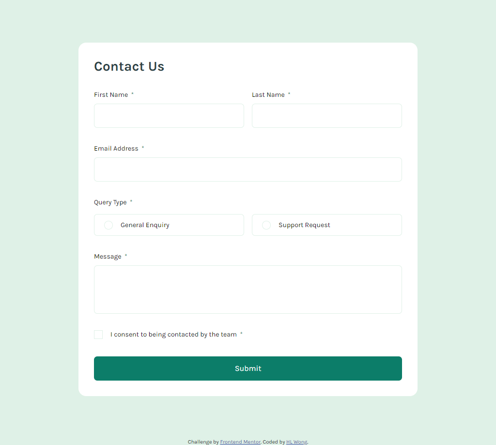
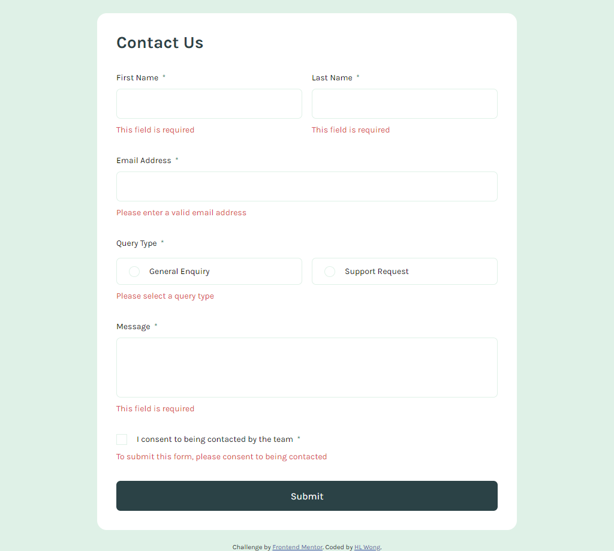
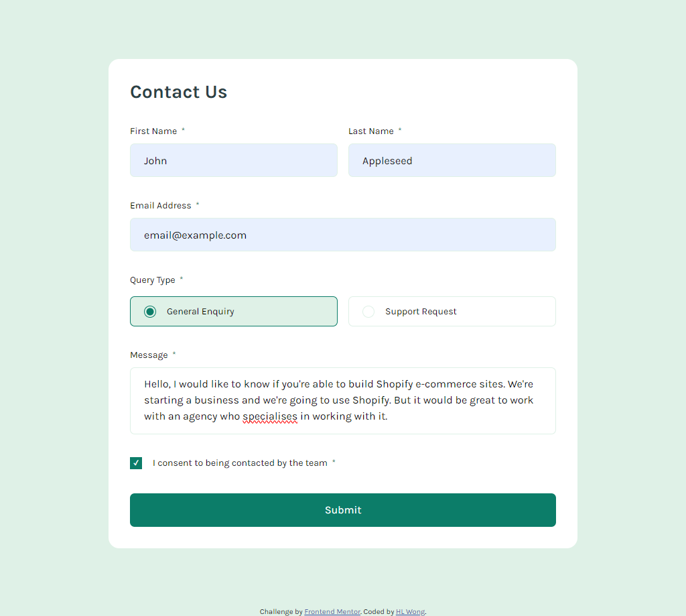
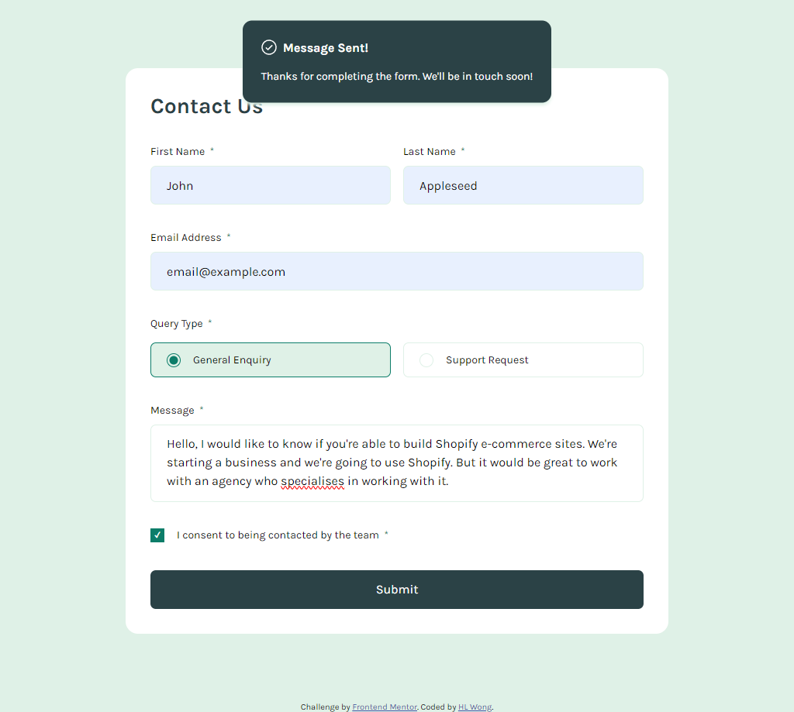
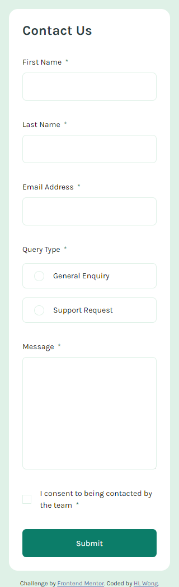
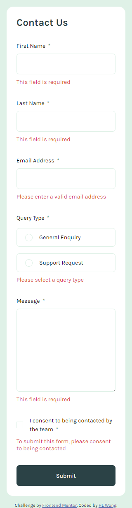
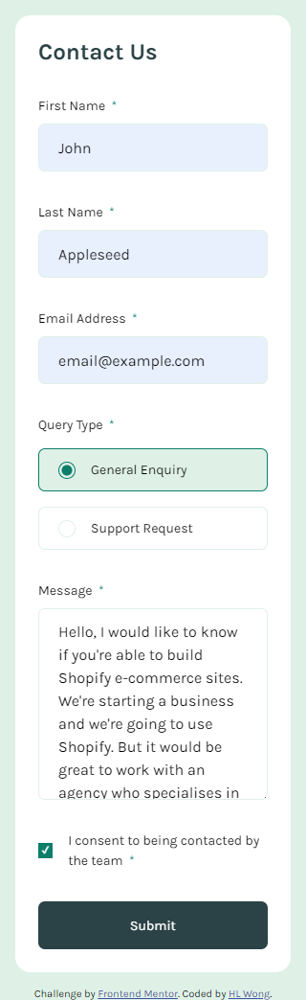
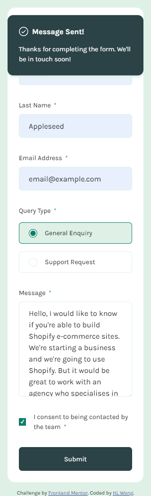

# Frontend Mentor - Contact form solution

This is a solution to the [Contact form challenge on Frontend Mentor](https://www.frontendmentor.io/challenges/contact-form--G-hYlqKJj). Frontend Mentor challenges help you improve your coding skills by building realistic projects.

## Table of contents

- [Overview](#overview)
  - [The challenge](#the-challenge)
  - [Screenshot](#screenshot)
  - [Links](#links)
- [My process](#my-process)
  - [Built with](#built-with)
  - [What I learned](#what-i-learned)
  - [Useful resources](#useful-resources)
- [Author](#author)

## Overview

### The challenge

Users should be able to:

- Complete the form and see a success toast message upon successful submission
- Receive form validation messages if:
  - A required field has been missed
  - The email address is not formatted correctly
- Complete the form only using their keyboard
- Have inputs, error messages, and the success message announced on their screen reader
- View the optimal layout for the interface depending on their device's screen size
- See hover and focus states for all interactive elements on the page

### Screenshot

### Desktop - 1024px






### Mobile - 320px






### Links

- Repository URL: [https://github.com/hl-wong/frontendmentor/tree/main/junior/contact-form-main](https://github.com/hl-wong/frontendmentor/tree/main/junior/contact-form-main)
- Solution URL: [https://www.frontendmentor.io/solutions/contact-form-7BkvcaAIk6](https://www.frontendmentor.io/solutions/contact-form-7BkvcaAIk6)
- Live Site URL: [https://hlwong-contact-form.netlify.app/](https://hlwong-contact-form.netlify.app/)

## My process

### Built with

- HTML
- CSS
- JavaScript

### What I learned

Based on the code below that have been used in this challenge, I have learned that when comes to styling the checkbox or radio button, that won't be work on the default checkbox or radio button, which requires to create own custom checkbox or radio button to style it with CSS.

```html
<div class="query__group">
  <input
    type="radio"
    name="query-type"
    id="general-enquiry"
    value="General Enquiry"
  />
  <label for="general-enquiry" class="query__general-enquiry">
    <span class="checkmark"></span>
    General Enquiry
  </label>

  <input
    type="radio"
    name="query-type"
    id="support-request"
    value="Support Request"
  />
  <label for="support-request" class="query__support-request">
    <span class="checkmark"></span>
    Support Request
  </label>
</div>

<label for="agreement">
  <span class="checkmark"></span>
  <p>I consent to being contacted by the team</p>
</label>
```

```css
.query__general-enquiry .checkmark,
.query__support-request .checkmark {
  height: 18px;
  width: 18px;
  border: 1px solid var(--green-lighter);
  border-radius: 50%;
  position: relative;
}

label[for="agreement"] .checkmark {
  height: 16px;
  width: 20px;
  border: 1px solid var(--green-lighter);
  position: relative;
}
```

### Useful resources

- [How to create a tick mark in a custom checkbox](https://stackoverflow.com/questions/43520218/how-to-create-a-tick-mark-in-a-custom-checkbox) - This resource help me when comes to create a tick mark in a custom checkbox.

- [Email Validation in JavaScript](https://www.codeproject.com/Tips/492632/Email-Validation-in-JavaScript) - This resource help me on how to validate email in JavaScript.

- [How to get value of selected radio button using JavaScript?](https://www.geeksforgeeks.org/how-to-get-value-of-selected-radio-button-using-javascript/) - This resource help me how to get the value of selected radio button when using JavaScript.

## Author

- Frontend Mentor - [@hl-wong](https://www.frontendmentor.io/profile/hl-wong)
- Twitter - [@hl_wong_01](https://x.com/hl_wong_01)
- GitHub - [@hl-wong](https://github.com/hl-wong)
- DEV - [@hl_wong](https://dev.to/hl_wong)
