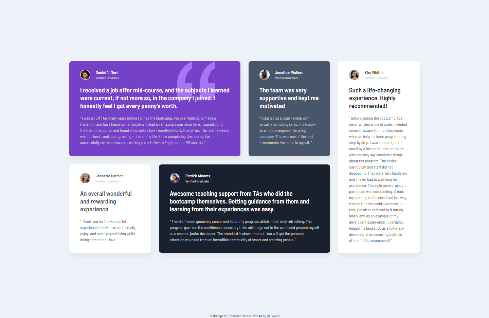
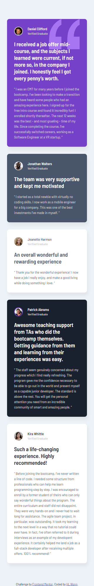

# Frontend Mentor - Testimonials grid section solution

This is a solution to the [Testimonials grid section challenge on Frontend Mentor](https://www.frontendmentor.io/challenges/testimonials-grid-section-Nnw6J7Un7). Frontend Mentor challenges help you improve your coding skills by building realistic projects.

## Table of contents

- [Overview](#overview)
  - [The challenge](#the-challenge)
  - [Screenshot](#screenshot)
  - [Links](#links)
- [My process](#my-process)
  - [Built with](#built-with)
- [Author](#author)

## Overview

### The challenge

Users should be able to:

- View the optimal layout for the site depending on their device's screen size

### Screenshot

### Desktop - 1440px

### Mobile - 320px

### Links

- Repository URL: [https://github.com/hl-wong/frontendmentor/tree/main/junior/testimonials-grid-section-main](https://github.com/hl-wong/frontendmentor/tree/main/junior/testimonials-grid-section-main)
- Solution URL: [https://www.frontendmentor.io/solutions/testimonials-grid-section-tz4a6Rayb6](https://www.frontendmentor.io/solutions/testimonials-grid-section-tz4a6Rayb6)
- Live Site URL: [https://hlwong-testimonials-grid-section.netlify.app/](https://hlwong-testimonials-grid-section.netlify.app/)

## My process

### Built with

- HTML
- CSS
- Flexbox
- CSS Grid
- SASS

## Author

- Frontend Mentor - [@hl-wong](https://www.frontendmentor.io/profile/hl-wong)
- Twitter - [@hl_wong_01](https://x.com/hl_wong_01)
- GitHub - [@hl-wong](https://github.com/hl-wong)
- DEV - [@hl_wong](https://dev.to/hl_wong)
