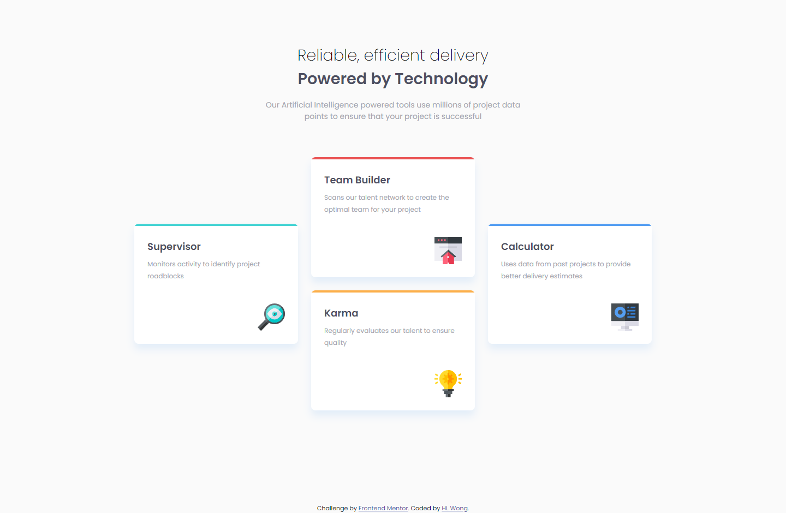
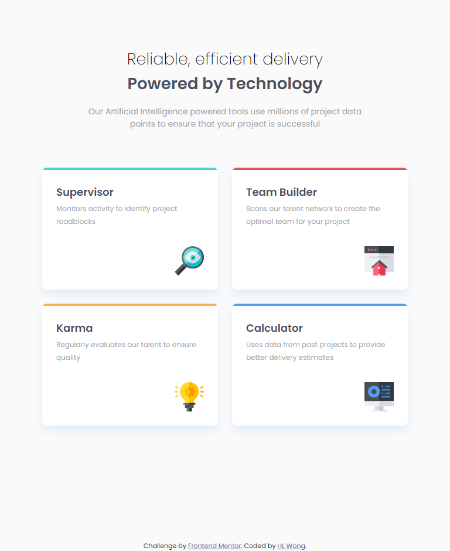
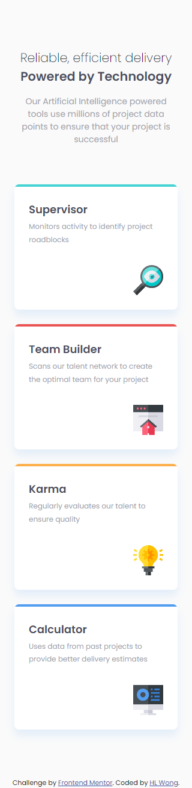

# Frontend Mentor - Four card feature section solution

This is a solution to the [Four card feature section challenge on Frontend Mentor](https://www.frontendmentor.io/challenges/four-card-feature-section-weK1eFYK). Frontend Mentor challenges help you improve your coding skills by building realistic projects.

## Table of contents

- [Overview](#overview)
  - [The challenge](#the-challenge)
  - [Screenshot](#screenshot)
  - [Links](#links)
- [My process](#my-process)
  - [Built with](#built-with)
  - [What I learned](#what-i-learned)
- [Author](#author)

## Overview

### The challenge

Users should be able to:

- View the optimal layout for the site depending on their device's screen size

### Screenshot

### Desktop - 1440px



### Tablet - 768px



### Mobile - 320px



### Links

- Repository URL: [Add repository URL here](https://your-repository-url.com)
- Solution URL: [Add solution URL here](https://your-solution-url.com)
- Live Site URL: [Add live site URL here](https://your-live-site-url.com)

## My process

### Built with

- HTML
- CSS
- SASS

### What I learned

What I have learned in this challenge is use CSS grid to build the flexible layout. Based on the code snippets below, I have used `grid-template-columns` to make it 2 column each 300px for tablet size. On the other hand, I used `grid-template-columns` to make it 3 column and use `grid-template-areas` and `grid-area` to adjust the cards based on the design given, and `align-items` center it.

```scss
@media screen and (min-width: 48em) {
  .main {
    &__content {
      grid-template-columns: 300px 300px;
    }
  }
}

@media screen and (min-width: 64em) {
  .main {
    &__content {
      grid-template-columns: 300px 300px 300px;
      grid-template-areas:
        "supervisor teambuilder calculator"
        "supervisor karma calculator";
      align-items: center;

      &__cards {
        &--supervisor {
          grid-area: supervisor;
        }

        &--tb {
          grid-area: teambuilder;
        }

        &--karma {
          grid-area: karma;
        }

        &--calculator {
          grid-area: calculator;
        }
      }
    }
  }
}
```

## Author

- Frontend Mentor - [@hl-wong](https://www.frontendmentor.io/profile/hl-wong)
- Twitter - [@hl_wong_01](https://x.com/hl_wong_01)
- GitHub - [@hl-wong](https://github.com/hl-wong)
- DEV - [@hl_wong](https://dev.to/hl_wong)
