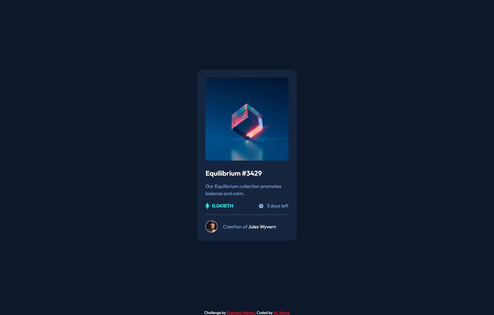
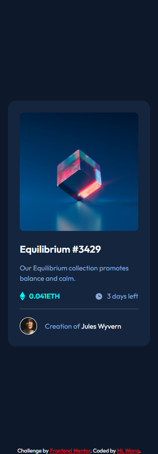

# Frontend Mentor - NFT preview card component solution

This is a solution to the [NFT preview card component challenge on Frontend Mentor](https://www.frontendmentor.io/challenges/nft-preview-card-component-SbdUL_w0U). Frontend Mentor challenges help you improve your coding skills by building realistic projects.

## Table of contents

- [Overview](#overview)
  - [The challenge](#the-challenge)
  - [Screenshot](#screenshot)
  - [Links](#links)
- [My process](#my-process)
  - [Built with](#built-with)
  - [What I learned](#what-i-learned)
- [Author](#author)

## Overview

### The challenge

Users should be able to:

- View the optimal layout depending on their device's screen size
- See hover states for interactive elements

### Screenshot

### Desktop - 1440px

### Mobile - 320px

### Links

- Repository URL: [Add repository URL here](https://your-repository-url.com)
- Solution URL: [Add solution URL here](https://your-solution-url.com)
- Live Site URL: [Add live site URL here](https://your-live-site-url.com)

## My process

### Built with

- HTML
- CSS
- SASS

### What I learned

What I learned before working this challenge is the methodologies and architectures from Frontend Mentor "Advanced CSS techniques". There was three popular methodologies, which is BEM (Block, Element, Modifier), CUBE CSS, and SMACSS (Scalable and Modular Architecture for CSS). In this challenge, I learned and applied BEM (Block, Element, Modifier) with CSS in the beginning, but after that I changed from CSS to SASS not need to write the long class name.

## Author

- Frontend Mentor - [@hl-wong](https://www.frontendmentor.io/profile/hl-wong)
- Twitter - [@hl_wong_01](https://x.com/hl_wong_01)
- GitHub - [@hl-wong](https://github.com/hl-wong)
- DEV - [@hl_wong](https://dev.to/hl_wong)
