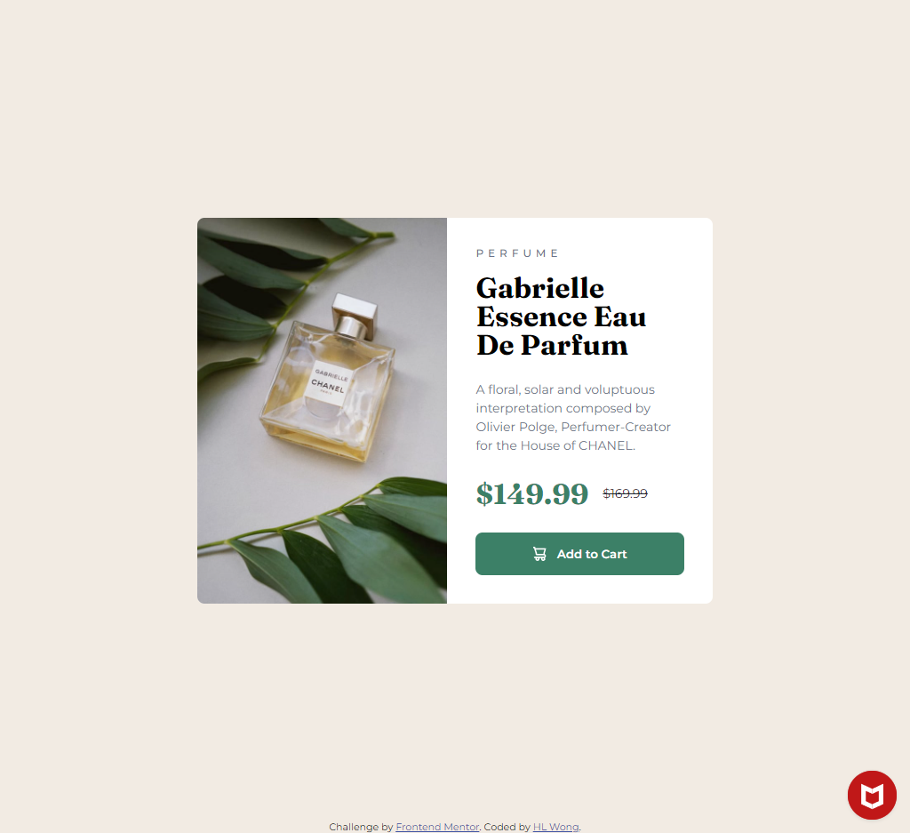
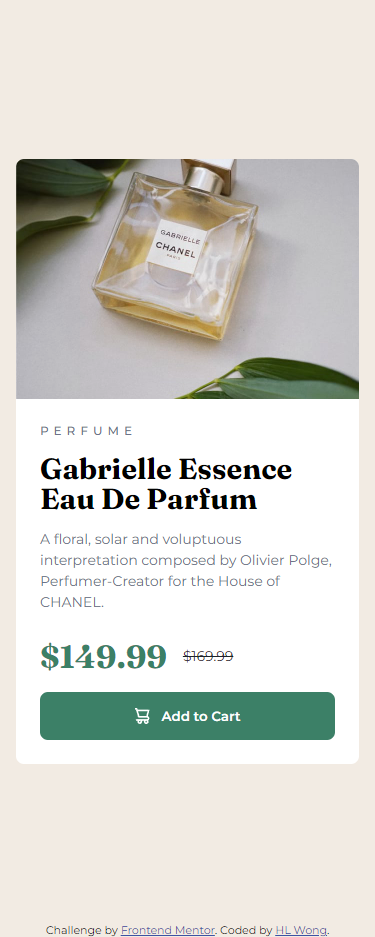

# Frontend Mentor - Product preview card component solution

This is a solution to the [Product preview card component challenge on Frontend Mentor](https://www.frontendmentor.io/challenges/product-preview-card-component-GO7UmttRfa). Frontend Mentor challenges help you improve your coding skills by building realistic projects.

## Table of contents

- [Overview](#overview)
  - [The challenge](#the-challenge)
  - [Screenshot](#screenshot)
  - [Links](#links)
- [My process](#my-process)
  - [Built with](#built-with)
  - [What I learned](#what-i-learned)
  - [Useful resources](#useful-resources)
- [Author](#author)

## Overview

### The challenge

Users should be able to:

- View the optimal layout depending on their device's screen size
- See hover and focus states for interactive elements

### Screenshot

### Desktop



### Mobile



### Links

- Repository URL: [https://github.com/hl-wong/frontendmentor/tree/main/newbie/product-preview-card-component-main](https://github.com/hl-wong/frontendmentor/tree/main/newbie/product-preview-card-component-main)
- Solution URL: [https://www.frontendmentor.io/solutions/product-preview-card-component-SSRkH4fi_H](https://www.frontendmentor.io/solutions/product-preview-card-component-SSRkH4fi_H)
- Live Site URL: [https://hlwong-product-preview-card.netlify.app/](https://hlwong-product-preview-card.netlify.app/)

## My process

### Built with

- HTML
- CSS
- SASS

### What I learned

What I have learned in this challenge is based on the code below. I learn and practice to use `clamp(min, preffered, max)` to make the text responsive, which reduce writing more media query to adjust the `font-size`. On top of that, I also have use `em` or `rem` for breakpoints to make it relative for all different sizes of devices.

```scss
&__title {
  font-family: variables.$font-fraunces;
  line-height: 1;
  margin-top: 1rem;
  font-size: clamp(1.5rem, 3.5vw + 1rem, 2rem);
}
```

```scss
@media screen and (min-width: 64em) {
  .main {
    &__card {
      display: flex;
      max-width: 580px;

      &__image {
        flex: 1.2;

        > img {
          border-top-right-radius: unset;
          border-bottom-left-radius: 8px;
          height: 100%;
        }
      }

      &__contents {
        flex: 1;
        padding: 2rem;

        &__desc {
          margin-top: 1.5rem;
        }

        &__btn {
          margin-top: 1.5rem;
        }
      }
    }
  }
}
```

### Useful resources

- [Typography | web.dev](https://web.dev/learn/design/typography) - This resource helped me on how to make the text responsive by using `clamp(min, preferred, max)`.
- [media queries in Yahoo Pure CSS](https://stackoverflow.com/questions/26594492/media-queries-in-yahoo-pure-css) - This resource helped me to get the CSS media query of `em` version, like `48em = 768px` and `64em = 1024px`.

## Author

- Frontend Mentor - [@hl-wong](https://www.frontendmentor.io/profile/hl-wong)
- Twitter - [@hl_wong_01](https://x.com/hl_wong_01)
- GitHub - [@hl-wong](https://github.com/hl-wong)
- DEV - [@hl_wong](https://dev.to/hl_wong)
