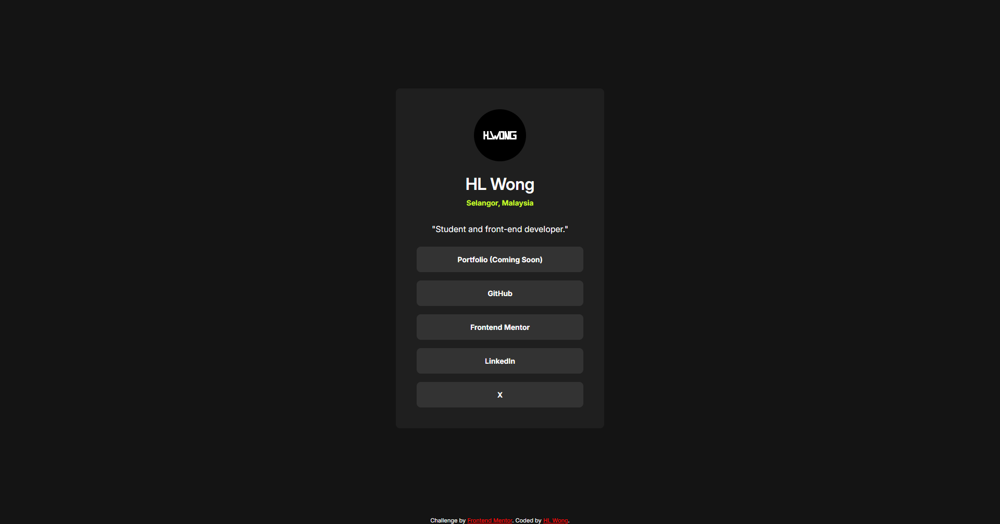
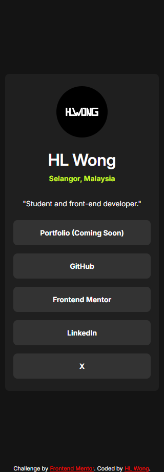

# Frontend Mentor - Social links profile solution

This is a solution to the [Social links profile challenge on Frontend Mentor](https://www.frontendmentor.io/challenges/social-links-profile-UG32l9m6dQ). Frontend Mentor challenges help you improve your coding skills by building realistic projects.

## Table of contents

- [Overview](#overview)
  - [The challenge](#the-challenge)
  - [Screenshot](#screenshot)
  - [Links](#links)
- [My process](#my-process)
  - [Built with](#built-with)
- [Author](#author)

## Overview

### The challenge

Users should be able to:

- See hover and focus states for all interactive elements on the page

### Screenshot

### Desktop

### Mobile

### Links

- Repository URL: [https://github.com/hl-wong/frontendmentor/tree/main/newbie/social-links-profile-main](https://github.com/hl-wong/frontendmentor/tree/main/newbie/social-links-profile-main)
- Solution URL: [https://www.frontendmentor.io/solutions/social-links-profile-cDOonzTbJJ](https://www.frontendmentor.io/solutions/social-links-profile-cDOonzTbJJ)
- Live Site URL: [https://hlwong-social-links-profile.netlify.app/](https://hlwong-social-links-profile.netlify.app/)

## My process

### Built with

- HTML
- CSS

## Author

- Frontend Mentor - [@hl-wong](https://www.frontendmentor.io/profile/hl-wong)
- Twitter - [@hl_wong_01](https://x.com/hl_wong_01)
- GitHub - [@hl-wong](https://github.com/hl-wong)
- DEV - [@hl_wong](https://dev.to/hl_wong)
